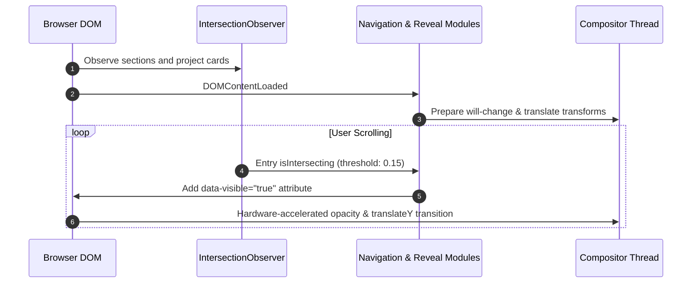

# Technical Design: Andres Lopez Portfolio

## Architectural Strategy: Clean Screaming Vanilla

Rather than depending on heavy framework abstractions that add megabytes of JavaScript, hydration latency, and runtime overhead, this portfolio uses pure modern web standards. Business and personal narrative are treated as pure domain content, decoupled from transport and styling concerns.

### Directory Structure
```
porfolio/
├── index.html                  # Single-source semantic document
├── src/
│   ├── styles/
│   │   ├── main.css            # Layer orchestrator
│   │   ├── tokens.css          # Color spaces (oklch), fluid typography, spacing
│   │   ├── reset.css           # Modern box model & accessible resets
│   │   ├── layout.css          # Semantic landmarks, CSS Grid, container queries
│   │   ├── components.css      # Card, badge, manifesto, showcase, button
│   │   └── animations.css      # Keyframes, GPU-promoted scroll states
│   └── scripts/
│       ├── main.js             # Application bootstrapper
│       ├── modules/
│       │   ├── observer.js     # IntersectionObserver for scroll reveals
│       │   ├── navigation.js   # Accessible focus management & header states
│       │   └── stats.js        # Performance & stress telemetry
│       └── utils/
│           └── dom.js          # Lightweight element helpers
└── test/
    ├── stress-audit.js         # Automated headless stress & performance audit
    └── markup.test.js          # Semantic validation & zero-divitis audit
```

## CSS `@layer` Architecture

To prevent specificity wars and enforce a clean cascade:
```css
@layer reset, tokens, layout, components, utilities;
```
1. `reset`: Modern CSS reset removing default browser quirks.
2. `tokens`: Palette in `oklch()`, fluid typography formulas, easing tokens.
3. `layout`: Grid layouts, container query definitions, responsive breakpoints.
4. `components`: Isolated component rules (`.showcase-card`, `.manifesto-quote`, `.terminal-header`).
5. `utilities`: Micro utilities (`.visually-hidden`, `.text-accent`, etc.).

## Color System (`oklch`)

```css
:root {
  /* Canvas & Structural Foundations */
  --color-canvas: oklch(0.12 0.01 0);          /* #0d0d0d Deep Obsidian */
  --color-surface-subtle: oklch(0.16 0.01 0);  /* Elevated Card Surface */
  --color-surface-border: oklch(0.24 0.01 0);  /* Subtle Border */
  --color-text-primary: oklch(0.96 0.01 90);   /* Crisp Off-White */
  --color-text-muted: oklch(0.65 0.02 90);     /* Balanced Slate Reading Gray */

  /* Identity Accents */
  --color-crimson: oklch(0.55 0.22 25);        /* Precision Crimson Red */
  --color-crimson-glow: oklch(0.55 0.22 25 / 0.15);
  --color-gold: oklch(0.78 0.14 75);           /* Antique Architectural Gold */
  --color-gold-glow: oklch(0.78 0.14 75 / 0.2);
}
```

## Typography Strategy (Typespiration)

- **Display Serif / Refined Header**: `Cinzel` or `Playfair Display` paired with `Plus Jakarta Sans` / `JetBrains Mono` for a fusion of classical authority and high-tech orchestrator precision.
- **Fluid Scaling**:
  ```css
  --font-size-hero: clamp(2.5rem, 5vw + 1rem, 5.5rem);
  --font-size-h2: clamp(1.75rem, 3vw + 0.5rem, 3rem);
  --font-size-body: clamp(1rem, 0.25vw + 0.95rem, 1.125rem);
  ```

## Runtime Interaction Flow



## Stress & Quality Verification

1. **Semantic HTML Validator**: Checks that `<div>` count is strictly minimized and that all content sections use semantic tags.
2. **Stress Scroll Simulation**: Script that programmatically triggers high-frequency scrolling, measuring FPS and memory footprint.
3. **No-JavaScript Fallback**: CSS is authored so that all text and project showcases are 100% visible and accessible even if JS is disabled.
